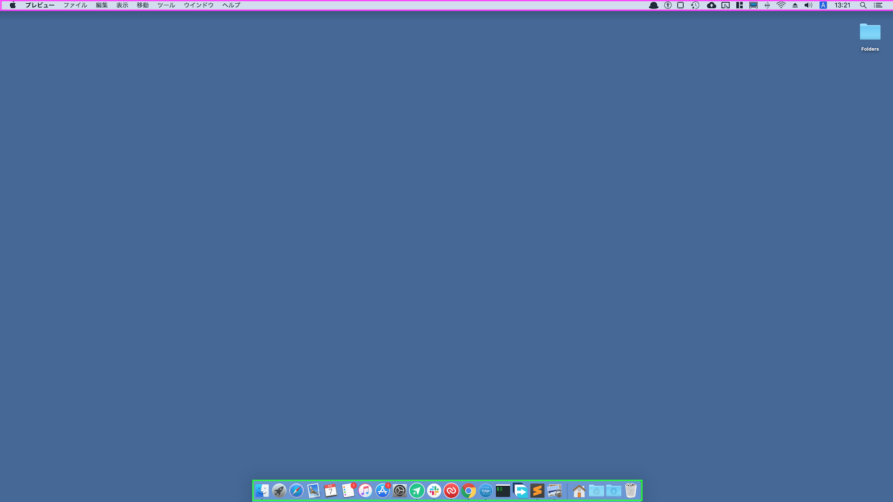
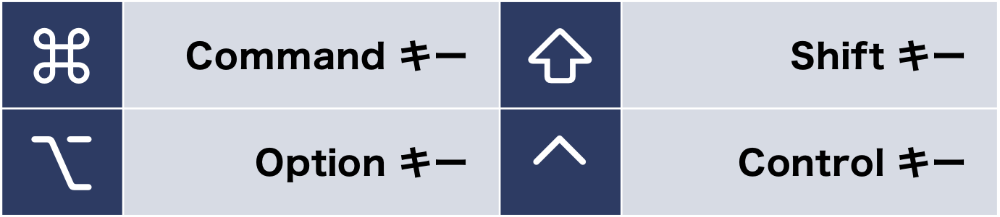
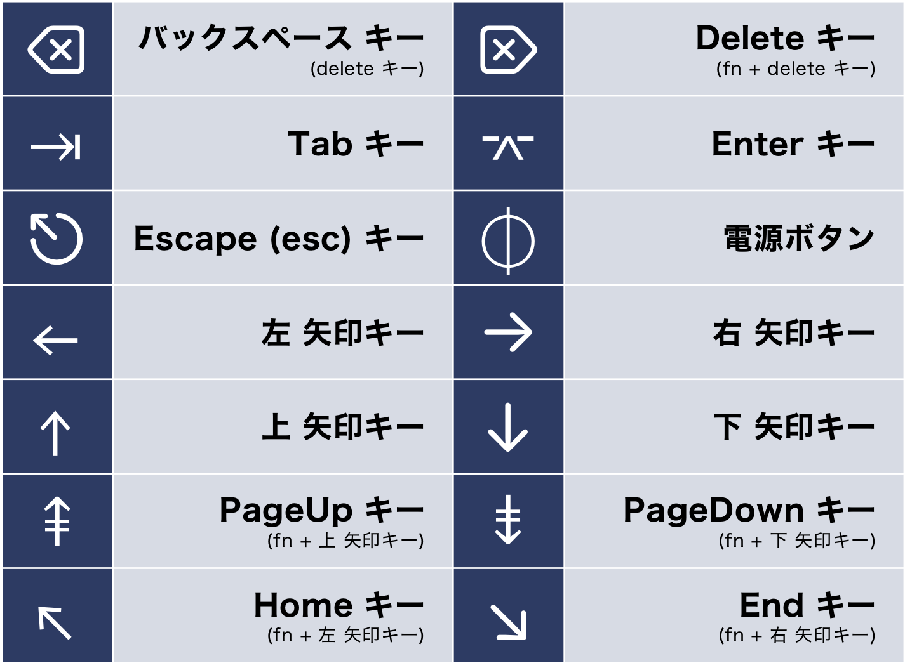

# これだけは覚えておこう for macOS

## まずは読んでみよう
[Mac の基本 − Apple](https://help.apple.com/macOS/mojave/mac-basics/?lang=ja)

## macOS の画面構成

- **メニューバー** (画面上部の紫枠)
  - メニューバーはアプリケーションごとに表示が切り替わる
    - Windows: 各ウィンドウにメニューバーがくっついている
    - macOS: **常に画面上部に固定**
  - メニューバー 左端にあるリンゴマークは「アップルメニュー」と呼ばれます
  - より詳しいことは、以下のリンクを参考に
  -   [Mac のメニューバーの内容 - Apple サポート](https://support.apple.com/ja-jp/guide/mac-help/mchlp1446/mac)

- **Dock** (画面下部の緑枠)
  - Dock には次のようなものが表示される 
    - **現在起動中のアプリ** 
    - ショートカットとして登録したアプリ・フォルダ
    - ゴミ箱(右端)
  - Dock にある黒い縦棒の部分をドラッグすることで、Dock の大きさを調整できる

## システム環境設定
- macOS の設定は基本的に「システム環境設定」から行う
  - Windows でいう 「設定」 (Windows10) や 「コントロールパネル」のようなもの
  - 開き方: **`[アップルメニュー]`** -> **`[システム環境設定]`**

## 修飾キー, ショートカットキー

- macOS では 4つの修飾キー を使用する
  - **`Command キー`**
    - コピペ・切り取りなど、多くのショートカットで使用する
    - Windows における `Windows キー` が該当する

  - **`Option (alt) キー`**
    - Command キーなどと組み合わせて使用される
    - Option キーを押すことで、メニューバーや右クリックのメニュー項目が変化することがある
    - Windows における `Alt キー` が該当する

  - **`Shift キー`**
    - Command キーなどと組み合わせて使用される
    - Shift キーを押すことで、メニューバーや右クリックのメニュー項目が変化することがある
    - Windows における `Shift キー` が該当する

  - **`Control キー`**
    - Command キーなどと組み合わせて使用される
    - 文字列の移動・操作などで使用することが多い
      - `Control + A`: 文字列の先頭に移動
      - `Control + E`: 文字列の末尾に移動

  - より詳しいことは、以下のリンクを参考に
    - [Mac のキーボードショートカット - Apple サポート](https://support.apple.com/ja-jp/HT201236)

- **macOS におけるキー記号の意味**

## 強制終了
- アプリケーションがフリーズした際は、「強制終了」を行う
  - 開き方: **`[アップルメニュー]`** -> **`[強制終了]`** 
  - ショートカット: 

